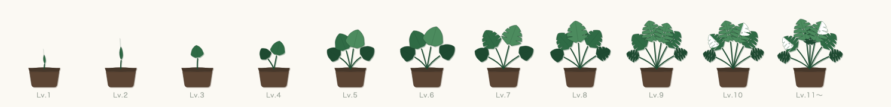
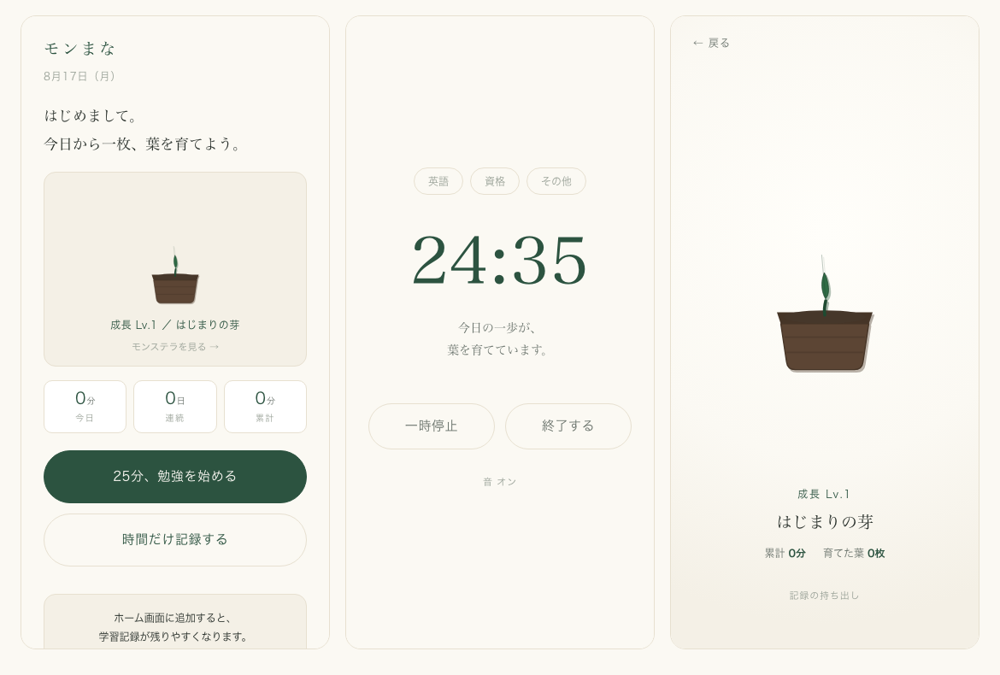

# モンまな

**勉強するたび、モンステラが育つ。**
小さな学びを、目に見える成長へ。

### ▶ [https://kaneryu129.github.io/monmana/](https://kaneryu129.github.io/monmana/)

ブラウザで開くだけで使えます。インストールも登録も要りません。



---

## 概要

25 分の学習を 1 回終えると、**1 しずく**（成長ポイント）がたまります。
しずくがたまるとレベルが上がり、モンステラが少しずつ育ちます。

Lv.10 で、はじめての**白い斑**が現れます。ここまで約 18 時間 45 分の学びです。



数字だけの勉強記録ではモチベーションが続きにくい人のために作りました。

### 大事にしていること

- **勉強を強制しない。** 「今日も勉強していません」のような文言は使いません
- **休んでもレベルは下がらない。** モンステラは枯れません
- **連続記録が途切れても、積み上げたものは失われません**
- 深夜の学習は前日ぶんとして数えます。日付が変わっただけで連続が切れません

## できること

| | |
| --- | --- |
| 25 分タイマー | 一時停止・途中終了できます。終了時に音で知らせます |
| 手動記録 | タイマーを使えなかった時間を後から記録できます |
| 成長 | 全 11 段階。Lv.7 で葉に切れ込み、Lv.10 で白い斑が現れます |
| 植物ビュー | 育てたモンステラを全画面で眺められます。葉をタップすると、その葉が育つまでの学習時間が分かります |
| 記録の持ち出し | JSON で書き出し・取り込みができます |
| オフライン動作 | 通信がなくても使えます |

**アカウント登録はありません。記録はお使いの端末内にだけ保存されます。**

## スマートフォンで使う

**ホーム画面に追加してください。** ブラウザのタブで開いたままだと、
iOS は 7 日間サイトを操作しないと保存した記録を削除します。
ホーム画面に追加した場合はこの削除の対象外になります。

### iPhone

1. **Safari** で [https://kaneryu129.github.io/monmana/](https://kaneryu129.github.io/monmana/) を開く
2. 画面下の**共有ボタン**（□ に ↑）をタップ
3. 下にスクロールして**「ホーム画面に追加」**
4. 右上の**「追加」**

### Android

ブラウザのメニューから「アプリをインストール」を選びます。
アプリ内にも案内が出ます。

---

## 開発

### 必要なもの

- Node.js 22 以上
- （任意）Google Chrome — 画面の目視確認とアイコン生成に使います

### 起動

```sh
git clone https://github.com/kaneryu129/monmana.git
cd monmana
npm install
npm run dev
```

**開いた URL には `/monmana/` が付きます。**

```
http://localhost:5173/monmana/
```

GitHub Pages のサブパス配信に合わせているためです。`/` だけでは表示されません。

### スマートフォンから開発中の画面を見る

`npm run dev` は LAN に公開されます。起動時に出る `Network:` の URL を、
同じ Wi-Fi につないだスマートフォンで開いてください。

```
➜  Network: http://192.168.x.x:5173/monmana/
```

iOS 固有の挙動（音・バイブレーション・ストレージ）はデスクトップでは再現しないため、
実機で確認する必要があります。

### コマンド

```sh
npm run dev        # 開発サーバ。LAN にも公開される
npm run build      # 型検査 + 本番ビルド
npm run preview    # ビルド結果を確認する
npm run lint       # oxlint
npm run typecheck  # tsc -b
npm run format     # Prettier
npm run test       # Vitest
npm run verify     # 上記の検査をまとめて実行（コミット前に使う）
```

**コミット前は `npm run verify` を使ってください。**
個別のコマンドをパイプに繋ぐと、終了ステータスが後段のものになり失敗を見落とします。

### ビルド結果をローカルで確認する

```sh
npm run build
python3 tools/preview-server.py
# http://localhost:8899/monmana/
```

`python3 -m http.server` では、`/monmana/timer` のような URL に直接アクセスすると
素の 404 が返り、本番と挙動が変わります。上のサーバーは GitHub Pages と同じく
`404.html` へフォールバックします。

### 図とアイコンの再生成

**SVG と画像は生成物です。直接編集しないでください。**

```sh
python3 design/plant/src/stages.py > src/ui/plant/stages.ts  # モンステラの形
python3 design/icon/src/render.py                            # アプリのアイコン
python3 design/screens/src/render.py                         # 画面モックアップ
```

図を変えたら、**必ず画像に書き出して目で確認してください。**
座標を書いただけでは、色が出ていないことにも形の破綻にも気づけません。

### デプロイ

`main` にマージすると GitHub Actions が自動でデプロイします。
`npm run build` に型検査が含まれるため、**型エラーがあればデプロイされません。**

---

## 構成

```
src/
  domain/     学習ロジック。React に依存しない純粋な TypeScript
  storage/    永続化。IndexedDB。ドメインから直接触らせない
  ui/         画面と部品。React に依存してよい唯一の層
    plant/    モンステラの描画
  styles/     デザイントークン
design/       図の生成スクリプトと検討用ページ
docs/
  spec.md     MVP 仕様書
  adr/        設計判断の記録
tools/        開発用スクリプト
```

**依存の向きは `ui` → `domain` / `storage`。** 逆向きの import はしません。

## 技術

Vite + React + TypeScript。**バックエンドはありません。**
データは IndexedDB に保存し、GitHub Pages で配信しています。

### 「完全無料」という制約

このプロジェクトは、**費用が一切かからない範囲で作る**ことを最優先の制約にしています。
これが技術選定の大半を決めました。

- ストア配信には Apple Developer Program が年 $99、Google Play が初回 $25 かかるため、
  **Web (PWA) を選びました**
- 素材のライセンス管理を避けるため、**終了音は Web Audio API で合成**しています
- アイコンの PNG 変換は**ヘッドレス Chrome** で行い、変換ツールを追加していません
- public リポジトリのため、GitHub Pages と Actions を上限なしで使えます

## 設計判断

**なぜそうしたのかを [`docs/adr/`](docs/adr/) に記録しています。**
コードを読めば「何をしているか」は分かりますが、「なぜそうしたのか」は残らないためです。

判断の一覧は [`docs/adr/README.md`](docs/adr/README.md) にあります。特に効いたもの:

| | |
| --- | --- |
| [0001](docs/adr/0001-platform-web-pwa.md) | 「完全無料」制約がプラットフォームを決めた経緯 |
| [0002](docs/adr/0002-local-only-persistence.md) | バックエンドを持たない判断と、それが生むリスク |
| [0008](docs/adr/0008-plant-art-style.md) | モンステラの画風と、作図で失敗した経緯 |
| [0012](docs/adr/0012-day-boundary-at-4am.md) | 一日の境界を午前 4 時にした理由 |
| [0015](docs/adr/0015-schema-migration.md) | データを壊さないための移行方針 |

決定が変わったときは、既存の ADR を書き換えず新しい ADR で置き換えます。

## 開発の進め方

Issue 駆動で進めています。実装前に Issue を作り、Issue 番号を含むブランチで作業し、
PR に `Closes #N` を書きます。詳細は
[ADR-0003](docs/adr/0003-issue-driven-development.md) にあります。

動作確認は Chrome (macOS) と iPhone の 2 環境で行います。
理由は [ADR-0007](docs/adr/0007-verification-strategy.md) にあります。

通し確認の手順は [`docs/mvp-checklist.md`](docs/mvp-checklist.md) にまとめてあります。

## ライセンス

未定
