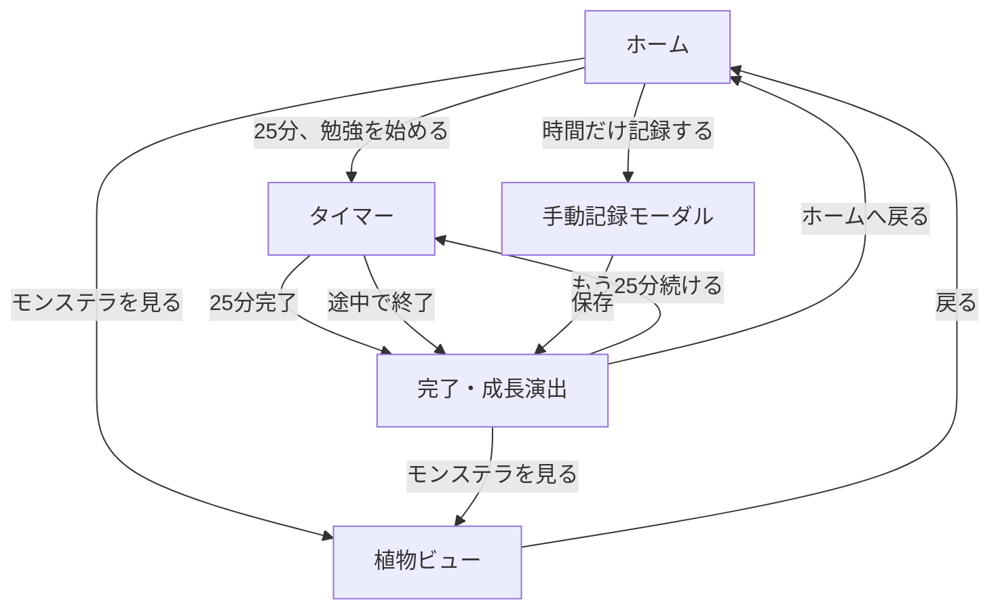

# モンまな MVP 仕様書

## 1. サービス概要

### サービス名

モンまな

### コンセプト

> 勉強するたび、モンステラが育つ。
> 小さな学びを、目に見える成長へ。

個人が日々の勉強習慣を記録し、学習時間の積み重ねに応じて一鉢のモンステラを育てるサービス。

### 想定ユーザー

- 勉強を習慣化したい個人
- 資格、語学、受験、プログラミングなどを学ぶ人
- 数字だけの勉強記録ではモチベーションが続きにくい人

## 2. MVP の対象範囲

### 実装するもの

- 25 分の学習タイマー
- タイマー終了時の音・バイブレーション
- 学習セッションの記録
- 手動での学習時間記録
- 今日の学習時間、連続学習日数、累計学習時間の表示
- 成長ポイントとレベル
- モンステラの段階的な成長
- 学習完了時の成長演出
- モンステラを全画面で眺める植物ビュー
- 直近の学習記録表示

### MVP では実装しないもの

- ログイン、アカウント作成
- 複数端末での同期
- ユーザー同士の交流、ランキング、SNS 共有
- 複数の植物からの選択
- 植物の着せ替え、複雑なカスタマイズ
- 複雑な科目管理
- カレンダー形式の詳細な履歴
- TODO 管理
- 有料プラン、課金
- 毎日の勉強リマインド通知

## 3. 画面一覧

| 画面・要素 | 役割 |
| --- | --- |
| ホーム | 今日の状態を確認し、勉強を始める |
| タイマー | 25 分間の集中時間を計測する |
| 完了・成長演出 | 勉強の達成を祝福し、成長を見せる |
| 植物ビュー | 育てたモンステラを全画面で鑑賞する |
| 手動記録モーダル | タイマーを使わなかった勉強時間を記録する |

## 4. 画面遷移

## 5. ホーム画面

### 目的

アプリを開いてから迷わず勉強を始められること。

### 表示内容

- サービス名「モンまな」
- 日付
- 挨拶と短いメッセージ
  - 例: おかえり。今日も一枚、葉を育てよう。
- 現在のモンステラの小さなプレビュー
- モンステラのレベル
  - 例: 成長 Lv. 4
- 今日の学習時間
- 連続学習日数
- 累計学習時間
- 主ボタン: 25 分、勉強を始める
- 補助ボタン: 時間だけ記録する
- 直近の学習記録
- 植物ビューへの導線

### 操作

- **25 分、勉強を始める**: タイマー画面へ遷移
- **時間だけ記録する**: 手動記録モーダルを開く
- **モンステラのプレビュー / モンステラを見る**: 植物ビューへ遷移

## 6. タイマー画面

### 目的

勉強中のユーザーを邪魔せず、集中を支えること。

### 表示内容

- 任意の勉強カテゴリ（MVP では英語、資格、その他程度）
  - カテゴリ選択は必須ではない
- 残り時間（初期値: 25:00）
- 応援メッセージ
  - 例: 今日の一歩が、葉を育てています。
- 一時停止ボタン
- 終了ボタン
- 音の設定導線

### 動作

- 25 分からカウントダウンする
- 一時停止・再開ができる
- ユーザーは途中終了できる
- 25 分経過時には、穏やかな終了音と軽いバイブレーションを行う
- 終了後は完了・成長演出画面へ遷移する

### 方針

タイマー中は、履歴、詳細設定、複雑なボタンを表示しない。集中を妨げない静かな画面にする。

## 7. 完了・成長演出画面

### 目的

勉強を終えた直後に、小さな達成感と「また続けたい」という気持ちをつくること。

### 通常時の表示内容

- メッセージ
  - おつかれさま！
  - 25 分の学びで、モンステラに水が届きました。
- モンステラの小さな反応
  - 葉が少し揺れる
  - 水滴が落ちる
  - 新芽が少し伸びる
- 今回記録した学習時間
- 今日の累計学習時間
- 次のレベルまでに必要な成長ポイント
- 任意のひとことメモ入力欄
  - 例: 英単語を 50 個復習した
- もう 25 分続けるボタン
- ホームへ戻るボタン

### レベルアップ時の表示内容

- レベルアップのメッセージ
  - 例: Lv.10 になりました！
- 新しい変化の説明
  - 例: あなたのモンステラに、はじめての白い斑が現れました。
- 変化した植物の表示
- モンステラを見るボタン
- 続けて勉強するボタン
- ホームへ戻るボタン

### 演出の方針

- 通常回は短く控えめな演出にする
- レベルアップ時だけ、葉が開く・斑が現れるなど明確な演出にする
- 毎回派手に演出しすぎない
- 成長の節目は、成長履歴に残せるようにする

## 8. 植物ビュー

### 目的

自分が積み重ねた勉強を、モンステラを眺めることで実感できるようにする。

### 表示内容

- 画面いっぱいに表示されるモンステラ
- 現在のレベル
- 累計学習時間
- 育てた葉の数
- 節目の成長記録
  - 例: はじめての斑入りの葉
  - 例: Lv.10 達成
  - 例: 2026 年 8 月 15 日
- ホームへ戻るボタン

### 表現

- ホーム画面より大きく、美しくモンステラを表示する
- 背景は余白が多く、静かで鑑賞しやすいものにする
- 成長に応じて、鉢・光・背景なども少しずつ変化する
- 葉をタップしたとき、葉の成長に関する情報を表示してもよい
  - 例: この葉は、累計 25 時間の学びで育ちました。

## 9. 手動記録モーダル

### 目的

タイマーを利用できない場面でも、勉強時間を記録できるようにする。

### 入力項目

- 学習時間（分）
- 任意の勉強カテゴリ
- 任意のひとことメモ

### 動作

- 保存すると学習履歴に記録される
- 25 分ごとに 1 しずくを付与する
- 成長ポイントの付与条件を満たした場合は、完了・成長演出を表示する

## 10. 成長ルール

### 基本ルール

- 25 分の学習完了 = 1 しずく（成長ポイント）
- 成長ポイントが一定数たまるとレベルアップする
- レベルは累計の成長ポイントで決まる
- 勉強を休んでもレベルは下がらない
- モンステラは枯れない
- 25 分未満の途中終了は、学習時間として記録するが、成長ポイントは付与しない
- 手動記録でも、25 分ごとに 1 しずくを付与する

### レベルアップに必要なしずく

| 現在 Lv. | 次の Lv. までに必要なしずく | 累計学習時間の目安 |
| --- | --- | --- |
| Lv.1 → Lv.2 | 1 | 25 分 |
| Lv.2 → Lv.3 | 2 | 75 分 |
| Lv.3 → Lv.4 | 3 | 150 分 |
| Lv.4 → Lv.5 | 4 | 250 分 |
| Lv.5 → Lv.6 | 5 | 375 分 |
| Lv.6 → Lv.7 | 6 | 525 分 |
| Lv.7 → Lv.8 | 7 | 700 分 |
| Lv.8 → Lv.9 | 8 | 900 分 |
| Lv.9 → Lv.10 | 9 | 1,125 分 |
| Lv.10 以降 | 10 | 約 25 時間以降 |

Lv.10 到達までに必要なしずくは合計 45 個。学習時間にすると約 18 時間 45 分。

### モンステラの進化段階

| レベル | 成長の変化 | 呼び名の例 |
| --- | --- | --- |
| Lv.1 | 土と小さな芽 | はじまりの芽 |
| Lv.2 | 芽がまっすぐ伸びる | のびる芽 |
| Lv.3 | 小さな葉が開く | はじめての葉 |
| Lv.4 | 葉が 2 枚になる | 若葉のモンステラ |
| Lv.5 | 茎と葉が大きくなる | 育ちざかり |
| Lv.6 | 鉢の見た目が少し変わる | 根づく鉢 |
| Lv.7 | 最初の切れ込みが葉に入る | 切れ込みの葉 |
| Lv.8 | 葉が増え、立体感が出る | 広がる葉 |
| Lv.9 | 大きな切れ込みの葉が育つ | 深まる緑 |
| Lv.10 | 最初の白い斑が現れる | 斑入りモンステラ |
| Lv.11 以降 | 葉・斑・鉢・背景がゆっくり進化 | あなただけのモンステラ |

### Lv.10 の演出

> ✨ Lv.10 になりました！
> あなたのモンステラに、はじめての白い斑が現れました。
> 25 分ずつ積み重ねた学びが、特別な一枚になりました。

## 11. 連続学習日数

### 基本ルール

- その日に 1 分以上の学習記録があれば、連続学習日数を継続する
- 連続日数は、レベルや成長ポイントとは別に扱う
- 連続記録が途切れても、植物のレベル・見た目・累計成長ポイントは失われない
- 再開時は責めずに迎える

### 節目の演出

| 継続日数 | 演出 |
| --- | --- |
| 3 日 | 葉が少し揺れる |
| 7 日 | 背景にやわらかい光が差す |
| 30 日 | 成長履歴に記念の記録を残す |

### 再開時の文言

> おかえり。また一緒に葉を育てよう。

## 12. 学習記録データ

### 学習セッション

| 項目 | 内容 |
| --- | --- |
| ID | 学習記録を識別する ID |
| 開始日時 | タイマーを開始した日時 |
| 終了日時 | タイマーを終了した日時 |
| 学習時間 | 実際に記録した学習時間（分） |
| 記録方法 | タイマー完了、途中終了、手動記録 |
| カテゴリ | 英語、資格、その他など。任意 |
| メモ | 学習内容や振り返り。任意 |
| 付与したしずく | この記録によって増えた成長ポイント |
| 作成日時 | 記録の作成日時 |

### ユーザーの成長状態

| 項目 | 内容 |
| --- | --- |
| 現在レベル | モンステラのレベル |
| 累計しずく | 累計の成長ポイント |
| 累計学習時間 | 全期間の学習時間 |
| 今日の学習時間 | 当日の合計学習時間 |
| 連続学習日数 | 学習した日が連続している日数 |
| モンステラの成長段階 | 現在表示する植物の状態 |
| 成長履歴 | レベルアップや節目の記録 |

## 13. デザイン・トーン

### 世界観

- 静か
- やさしい
- 清潔感がある
- 余白が多い
- 勉強を強制しない
- 成長を一緒に喜ぶ

### 色

- 白や淡いベージュをベースにする
- 深い緑を主なアクセントにする
- 斑入りの段階では、白と淡い黄緑を上品に使う

### 使用する文言の例

- 今日も一枚、葉を育てよう。
- おつかれさま。葉に水が届きました。
- また一緒に育てよう。
- あなたの学びが、新しい葉になりました。
- 今月、あなたは○枚の葉を育てました。

### 避ける文言の例

- 今日も勉強していません
- 連続記録が失われました
- 目標未達成です
- サボっています

## 14. MVP の完成条件

以下の体験を最初から最後まで問題なく行えること。

1. ユーザーがホーム画面を開く
2. 25 分、勉強を始めるを押す
3. タイマーが 25 分間動く
4. 終了時に音またはバイブレーションで知らせる
5. 学習時間が記録される
6. 成長ポイントが付与される
7. モンステラが小さく反応する
8. レベルアップ時には植物の見た目が変化する
9. ユーザーが植物ビューでモンステラを眺められる
10. 次回アプリを開いたときにも、学習記録とモンステラの成長状態が保持されている
